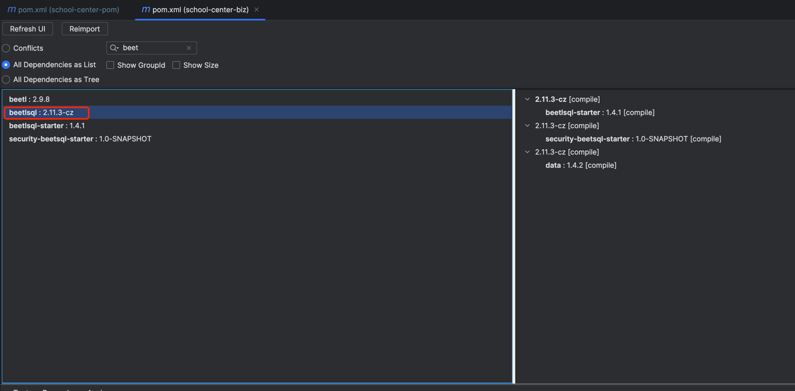

## 该starter为BeetSql项目提供敏感字段加解密服务,接入应用需在测试环境测试通过后再部署生产环境
### 敏感字段插件接入流程

#### 1.引入依赖,并检查依赖冲突情况
```xml
<dependency>
    <groupId>cn.cz</groupId>
    <artifactId>security-beetsql-starter</artifactId>
    <version>1.0</version>
</dependency>
```
#### 2.在项目中定义如下beetsql版本
```xml
<beetlsql.version>2.11.3-cz-SNAPSHOT</beetlsql.version>
```

#### 3.检查项目依赖,确保项目中实际使用的beetsql版本如下图所示


#### 4.备份数据后,调整敏感字段的长度,建议长度128,分批对存量数据进行清洗,使用指定key将明文清洗为密文
```sql
例:
alter table tb_teacher modify phone varchar(128) null comment '电话';

update ai_school_center.tb_teacher set certify_number= hex(aes_encrypt((certify_number ),'encrypt_key')) ,phone = hex
(aes_encrypt((phone ),'encrypt_key')) where id <=5000;
```

#### 5.在配置文件中加入敏感表和敏感列的具体配置,必须按格式指定scheme,table,column
```yaml
security:
  encryptKey: encrypt_key # 加解密key
  schemaConfigList:
    - scheme: ai_independent_app # scheme名
      sensitiveTableSensitiveColumnMap:
        qa_template: [ question_name,org_name ] # 表名:列名
        qa_answer: [ org_name ]  # 表名:列名
    - scheme: ai_school_center  # scheme名
      sensitiveTableSensitiveColumnMap: 
        tb_teacher: [ certify_number,phone ] # 表名:列名

```

